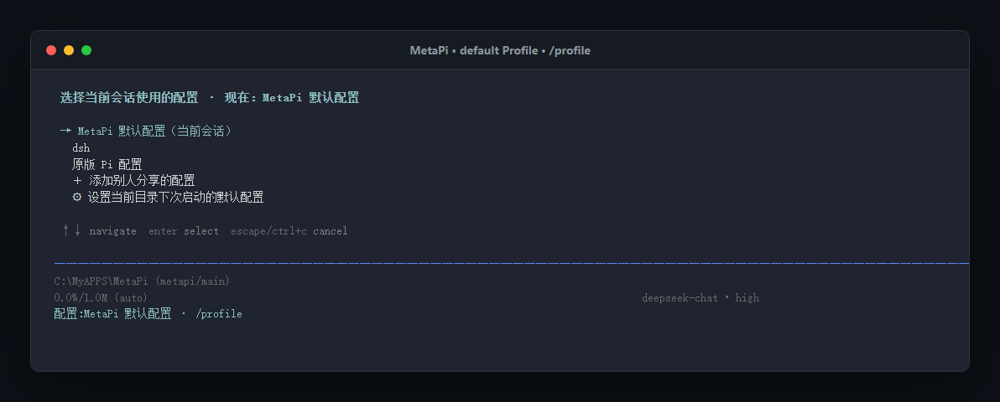

<div align="center">


# Meldra

### 基于 Pi 的 Agent 框架与启动器

Meldra 以 Profile 组织模型、Provider、插件、Session、WorkSpace 与外部 Agent Runtime，同时保留官方 Pi 的终端体验和兼容路径。

<p>
  
  
  
  
  
  
</p>

[中文](README.md) · [English](README.en.md) · [使用教程](docs/user-guide.md) · [开发文档](docs/development.md) · [Pi 参考](packages/coding-agent/docs/index.md)

</div>

> [!IMPORTANT]
> **Meldra 当前处于开发阶段。** 仓库尚未配置正式 Meldra npm 包、发行源或自更新服务。
> 当前可靠入口是从源码运行；`meldra update --self` 保持禁用，避免误装官方 Pi 包。

<p align="center">
  
</p>
<p align="center"><sub>当前构建的真实 TUI：在同一 Session 和 WorkSpace 中查看并切换隔离 Profile。</sub></p>

## 为什么是 Meldra

| 你得到什么 | 实际含义 |
|---|---|
| **一个 Pi-based Agent 框架与启动器** | 复用 Pi 的 CLI、TUI、工具与 Extension 生态，在其上增加 Profile、WorkSpace 和外部 Runtime 边界 |
| **项目组持续调校的极简 Starter Profile** | 默认 `Meldra Starter` 用少量默认能力提供稳定、直接的日常开发入口 |
| **可分享的完整 Profile 配置** | 导入后复用模型选择、Provider 声明、插件、Scout 与工作流；凭据由导入者在本机补充 |
| **统一体验下的外部 Agent Runtime** | DSH 保留原生 Agent 所有权，同时接入 Meldra 的 Pi TUI、Profile 生命周期与模型选择体验 |
| **出错时仍有第二条工作路径** | DSH 出错时切换到同一 WorkSpace 中的默认 Pi Agent，诊断并修复后再切回 DSH |

## ✨ 核心能力

| | 能力 | Meldra 的边界 |
|---|---|---|
| 🧭 | **Profile 隔离** | 工作流设置、模型、Package、Session 与 Runtime 状态独立；界面偏好由普通 Profile 共享 |
| π | **Pi 原生兼容** | 保留 Pi CLI、TUI、工具、Session、Extension 生态和原始 `pi` compatibility 入口 |
| 🧳 | **Portable Profile** | 导入、导出、更新并分享配置、资源、工作流和 Runtime 声明；官方 Pi 可忽略 Meldra metadata |
| 🗂️ | **Session WorkSpace** | 内建 WorkSpace 插件为 Session 分配工作目录，不把 Profile 状态迁入项目 `.pi` |
| 🔌 | **外部 Runtime** | 通过产品无关 provider 在 construction-time 接入外部 Agent 后端 |
| ◈ | **DeepSeek Harness** | 共享 Meldra 的 TUI 与模型选择体验，Harness 仍保持 Agent loop、工具、Settings 与 Session 权威 |
| ⚙️ | **统一插件配置** | 普通 Profile 自动获得 `/config` TUI；default Starter 通过 `/setup` 引导 Provider、模型和 Scout 配置 |

Meldra 是建立在 [Pi](https://github.com/earendil-works/pi) 完整源码上的 Agent 框架、启动器和可审计补丁层。
它扩展 Pi，但不复制 Pi agent，也不把外部 Runtime 改造成另一套 Pi Session。

## 🧭 一套环境，一个 Profile

| 环境 | 默认状态位置 | 用途 |
|---|---|---|
| `default` | `~/.meldra/profiles/default/` | Meldra 默认隔离环境 |
| 普通 Profile | `~/.meldra/profiles/<name>/` | 独立工作流、模型、插件与可选 Runtime |
| `pi` | `~/.pi/agent/` | 原始 Pi compatibility，不接受 Meldra 专属注入 |
| WorkSpace | `~/.meldra/workspaces/` 或显式目录 | 当前 Session 的工作目录 |

> [!NOTE]
> Profile 的解析顺序固定为：显式 `--profile` → 最近的目录绑定 → `default`。
> WorkSpace 只决定工作目录，不拥有 Profile 的模型、设置或 Runtime plugin。

Portable Profile 使用 Pi-compatible `package.json`。其他用户导入后即可获得同一套可分享配置；凭据、Session 和机器本地路径不会进入 Bundle，首次使用时由导入者补充自己的 Provider 凭据。每次导出还会生成脱敏文件清单与硬编码凭据提示。

## 🚀 快速开始

| 安装入口 | 状态 | 说明 |
|---|---|---|
| 从源码运行 | `SUPPORTED` | 开发与审计入口 |
| [`Meldra-Setup.exe`](https://github.com/Slapq/Meldra/releases/tag/v0.2.2) | `SUPPORTED` | Windows x64；内置 Node.js 与 portable Windows Terminal，无需预装 Node.js |
| [`Meldra-Setup-NodeJS.exe`](https://github.com/Slapq/Meldra/releases/tag/v0.2.2) | `SUPPORTED` | Windows x64；使用已有 Node.js，缺失或版本较低时提示但不阻止安装 |
| scoped npm Bootstrap | `PLANNED` | Meldra organization 与包名尚未确认，不提供假命令 |
| Starter Bundle + 配置向导 | `SUPPORTED` | `meldra setup` 安装或恢复 Bundle；进入 default 后用 `/setup` 完成 Provider、模型、Scout 与 thinking level 引导，可随时跳过 |
| Windows 桌面快捷方式 | `SUPPORTED` | 使用安装器内置 Windows Terminal 启动 `meldra --profile default --workspace` |

安装器把 `meldra` 加入当前用户 PATH，因此可以在 PowerShell、cmd、Git Bash、Windows Terminal、VS Code terminal 等任意新开的终端中运行。内置 Windows Terminal 只作为桌面快捷方式的默认宿主，不限制其他终端。

已确认的安装与 onboarding 合同见 [Setup 与发行合同](docs/setup-and-distribution.md)。

### 环境要求

安装器支持 Windows 10 build 19041+ / Windows 11 x64，并内置 Windows Terminal。`Meldra-Setup.exe` 同时内置 Node.js；轻量版 `Meldra-Setup-NodeJS.exe` 使用系统 Node.js。两版的 Bash tool 仍需要 Bash，推荐 Git for Windows。

从源码运行需要：

- Node.js `>= 22.19.0`
- npm 与 Git
- Linux 上用于 DSH native modules 的 Python 3、Make 和 C++ toolchain
- Windows 上可用的 Bash

### 从源码运行

```bash
npm install --ignore-scripts
npm run prepare:native-runtime
npm run build
```

<table>
<tr><th>Linux / macOS</th><th>Windows PowerShell</th></tr>
<tr><td>

```bash
./pi-test.sh
```

</td><td>

```powershell
.\pi-test.ps1
```

</td></tr>
</table>

启动脚本保留调用时的当前目录，因此可以直接从目标项目目录运行。
进入 TUI 后使用 `/login` 配置普通 Pi Provider，再用 `/model` 选择模型。

```text
分析这个仓库，说明项目结构，并告诉我应该运行哪些检查。
```

## 🧰 日常入口

| 目标 | TUI | 终端 |
|---|---|---|
| 管理 Profile | `/profile` | `meldra profile list` |
| 查看 Profile 状态 | `/profile status` | `meldra profile status` |
| 创建 WorkSpace | `/workspace` | `meldra --workspace [dir]` |
| 配置 Starter Profile | `/setup` | `meldra setup` |
| 配置插件字段 | `/config` | — |
| 管理 Pi Package | — | `meldra install` / `list` / `config` |
| 恢复 Session | `/resume` | `meldra -c` / `meldra -r` |
| 分享并审计 Profile | `/profile export` | `meldra profile export <name>` |
| 导出 Session | `/export` | `meldra --export <file>` |
| 重新加载资源 | `/reload` | — |

详细步骤、目录绑定、Profile Bundle 与故障处理见 [完整使用教程](docs/user-guide.md)。

## 🔌 两类插件，两个所有者

| | Pi Package | Profile Runtime Plugin |
|---|---|---|
| 管理对象 | Extension、Skill、Prompt、Theme | 外部 Runtime 原生 plugin |
| 作用域 | 当前 Profile；`-l` 才是 WorkSpace `.pi` | 指定 Profile Runtime |
| 入口 | `meldra install` / `config` | `meldra profile plugins` |
| 权威 | Pi Package manager | 对应 Runtime provider |

> [!TIP]
> `/config` 是 Profile 插件字段界面；`/settings` 属于当前 Agent Runtime；
> `meldra config` 是 Pi Package resource selector。三者不是同一个配置层。

普通插件配置遵循固定的 [Profile Config 注册规范](docs/extensions/profile-config-protocol.md)，
以保持字段、存储位置和交互风格一致。

## ◈ DeepSeek Harness，原生运行

任何 Portable Profile 都可以通过 `runtime.provider: "deepseek-harness"` 选择 DSH；Profile 名称不需要叫 `dsh`。

```bash
meldra --profile research-harness
```

进入后使用 `/dsh` 打开管理中心。常用入口包括：

```text
/resume  /sessions  /model  /preset  /settings  /queue  /plugins  /dsh trajectory
```

Harness 负责 Agent loop、Session ledger、模型、Preset、工具、队列、Settings、插件与持久化；Meldra 负责 Profile 生命周期、协议适配、Pi TUI 展示和经过验证的模型桥。DSH 因此可以使用与普通 Meldra Profile 一致的界面设计语言和模型选择入口，而不共享可写 Session。

DSH 出错时，可在同一 WorkSpace 中切换到默认 Pi Agent，检查项目与集成状态、实施修复，再切回 DSH。这是人工恢复工作流，不是自动多 Agent 编排。

[查看完整 DSH 能力与当前限制 →](packages/coding-agent/docs/deepseek-harness.md)

## 📚 文档

| 文档 | 内容 |
|---|---|
| [使用教程](docs/user-guide.md) | 从启动到 Profile、WorkSpace、插件、DSH 与 Session 导出 |
| [Setup 与发行合同](docs/setup-and-distribution.md) | 当前入口与计划中的安装器、Bootstrap、Starter Bundle、onboarding 和快捷方式 |
| [开发文档](docs/development.md) | 架构所有权、扩展点、测试、upstream 同步与发行边界 |
| [文档索引](docs/README.md) | Meldra 与 Pi reference 的完整导航 |
| [Profile Runtime](packages/coding-agent/docs/profile-runtimes.md) | 外部 Agent Runtime provider 合同 |
| [Extension 开发](packages/coding-agent/docs/extensions.md) | command、tool、event、renderer 与 TUI |
| [领域术语](CONTEXT.md) | Profile、WorkSpace、Runtime 与 Package 的权威定义 |
| [架构决策](docs/adr/) | 当前产品与兼容性决策 |

## 🛠️ 开发

```bash
npm run build
npm run check
npm test
```

Meldra 维持“**精确 Pi baseline + 可审计 patch layer**”。普通 Pi 行为、公开协议和 Profile 数据默认保持兼容；
运行时修改必须先确认真实合同与范围，并验证 `default`、`pi` compatibility 和受影响的 Runtime Profile。

[阅读开发与贡献流程 →](docs/development.md)

## ⚠️ 当前边界

> [!WARNING]
> - Meldra 和 Pi 默认使用启动用户的文件、进程与网络权限，**不提供内建沙箱**。
> - 第三方 Package 与 Runtime plugin 可能访问网络或执行 lifecycle scripts，请先检查来源。
> - DeepSeek Harness 固定为 `0.1.0-rc.8`，其 RC 协议未来可能变化。
> - Windows 全量测试仍有已记录的平台差异；聚焦测试不能代替真实 TUI/Runtime 验收。

## 🌱 上游与许可证

Meldra 基于 [earendil-works/pi](https://github.com/earendil-works/pi) 的完整源码维护，保留 MIT 许可证。
它的目标不是替代 Pi，而是在可回溯的上游基线上承载隔离 Profile、外部 Runtime 和多工作环境体验。
