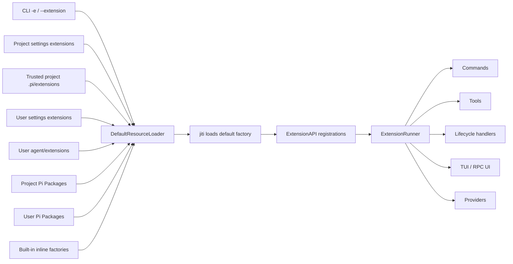

# Pi Extension Index

This index describes the Extension ecosystem in the Meldra upstream baseline **Pi v0.84.2**
(`914cf1472e715297caa30db4b9535d534a9eb718`) plus the current Meldra patch layer.

## What “plugin” means here

The canonical Pi term is **Extension**: an executable TypeScript or JavaScript module whose default factory receives
`ExtensionAPI`. An Extension may register tools, commands, providers, flags, shortcuts, renderers, or lifecycle
handlers.

Do not merge these distinct concepts:

| Concept | Meaning | Executable Extension? |
|---|---|---:|
| Extension | Runtime module loaded by Pi | Yes |
| Pi Package | npm, Git, or local distribution container | Maybe; it can contain Extensions and/or resources |
| Skill | On-demand agent instructions | No |
| Prompt Template | Slash-expanded reusable prompt | No |
| Theme | JSON terminal color resource | No |
| Profile Bundle | Meldra launch-environment package built on Pi Package resources | It may contain Extensions |

Sources: [`packages/coding-agent/docs/extensions.md`](../../packages/coding-agent/docs/extensions.md),
[`packages/coding-agent/docs/packages.md`](../../packages/coding-agent/docs/packages.md), and
[`packages/coding-agent/src/core/pi-manifest.ts`](../../packages/coding-agent/src/core/pi-manifest.ts).

## Inventory at this baseline

| Set | Count | Loaded by default? | Catalog |
|---|---:|---:|---|
| Product inline Extensions | 6 | Yes; 5 static built-ins plus the ordinary-Profile `meldra-hooks` factory | [Built-in and local](built-in-and-local.md#product-built-in-extensions) |
| Pi official Extension examples | 78 | No | [Official examples](official-examples.md) |
| Current original-Pi user Extensions | 5 | In the original Pi user scope | [Built-in and local](built-in-and-local.md#current-machine-inventory) |
| Current Meldra repository project Extensions | 4 | When this project is trusted | [Built-in and local](built-in-and-local.md#current-machine-inventory) |
| **Indexed runtime entries** | **93** | Mixed | 6 product inline Extensions + 78 official examples + 9 current-machine entries |
| Test-only Extension factories | Multiple | No; test harness only | [Test fixtures](built-in-and-local.md#test-only-extension-fixtures) |

The 78 official examples are source examples, not a recommended all-at-once plugin set. Sixty-eight appear in the
example README category tables; ten exist in the directory but are not listed in those tables.

## Documents

- [Built-in and current-machine Extensions](built-in-and-local.md) — the six product inline Extensions and the nine currently
  configured or discovered Extension entries.
- [Official example catalog](official-examples.md) — every one of the 78 official examples, including entry points, user
  surface, state, dependencies, and direct relationships.
- [Relationship model](relationships.md) — loading order, collision rules, event chaining, UI replacement, shared state,
  and functional clusters.

## Product development guides

- [Meldra Starter plugin development](../../packages/coding-agent/starter-profile/DEVELOPMENT.md) — Profile Config,
  Provider Manager, Scout, Workflows, Questionnaire, Setup, packaging, testing, and troubleshooting.
- [Meldra Hook 编写与开发](../hooks.md) / [English](../hooks.en.md) — Handler authoring, Decision protocol,
  Runtime Adapters, TUI, security, and validation.
- [Profile Config registration protocol](profile-config-protocol.md) — normative Chinese contract.
- [Profile Config registration protocol (English)](profile-config-protocol.en.md) — normative English contract.
- [Built-in and current-machine Extensions](built-in-and-local.md) — runtime inventory and ownership boundaries.

## Loading model in one picture

The stable path precedence in this baseline is:

1. CLI temporary Extension sources;
2. project settings Extensions;
3. trusted project auto-discovered Extensions;
4. user settings Extensions;
5. user auto-discovered Extensions;
6. Package Extension resources (project Package entries are collected before user Package entries, within one shared
   Package precedence rank);
7. built-in inline factories.

See [relationships.md](relationships.md#load-and-distribution-relationships) for deduplication and collision semantics.

## Maintenance procedure

When upgrading to a later official Pi release:

1. enumerate `packages/coding-agent/examples/extensions/` again;
2. compare `builtInExtensions` and Meldra inline factories;
3. compare Extension API events and registration methods;
4. rerun the command/tool/flag/shortcut/UI relationship scan;
5. update the dated current-machine inventory separately from the official catalog.

Do not infer that a newly added example is enabled by default. Do not infer Package ownership from a command name; Pi
exposes `sourceInfo` for provenance.
