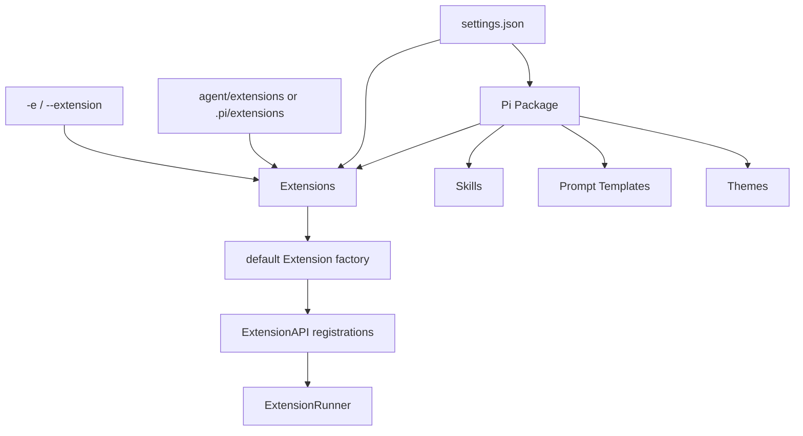
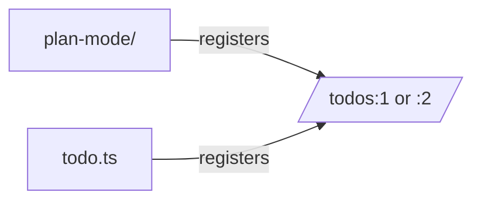
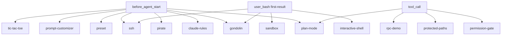
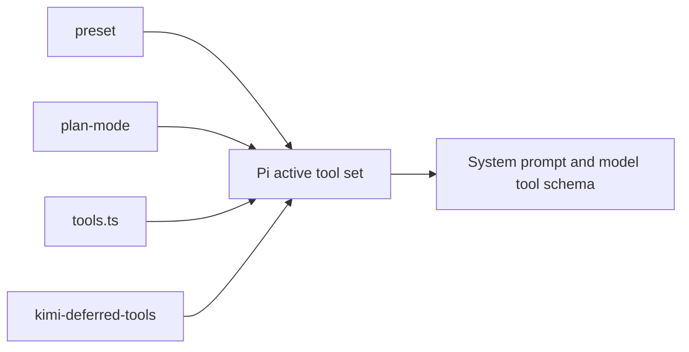
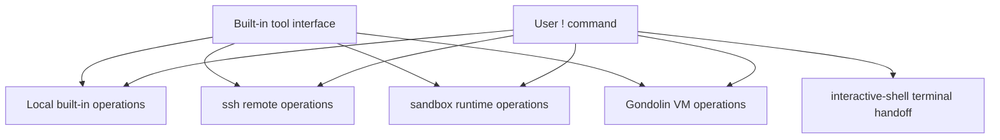
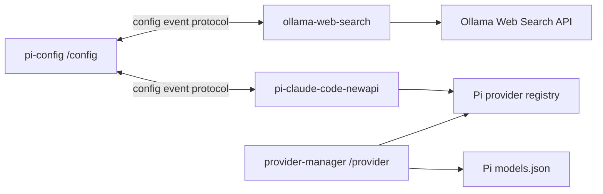

# Pi Extension Relationship Model

This document explains how Extensions relate to Pi and to one another in the v0.84.2 baseline. It distinguishes relationships implemented by the runtime from merely similar functionality.

## Load and distribution relationships

### Resource graph



A Pi Package is a distribution relationship, not a runtime parent object. Its `package.json.pi` manifest may declare `extensions`, `skills`, `prompts`, and `themes`. Without a manifest, Pi discovers those conventional directories.

### Path precedence

The baseline orders path Extensions as follows, then appends built-in inline factories:

1. CLI temporary Extension sources;
2. project settings Extensions;
3. trusted project `.pi/extensions` entries;
4. user settings Extensions;
5. user `<agentDir>/extensions` entries;
6. Package Extension resources (one Package precedence rank; current Package collection visits project entries before user entries);
7. named/anonymous built-in inline factories.

CLI and resolved resource paths are deduplicated by canonical path. Resolved resources are sorted by precedence before canonical-path deduplication, so the highest-precedence occurrence is retained. Package resources share one rank; their relative order follows Package collection/insertion order. Package identity deduplication uses npm package name, Git repository identity, or resolved local path.

Project Extension and Package resources do not join the final set until project trust is resolved. The bootstrap pass contains user/global, CLI temporary, and inline Extensions; the final pass reorders all loaded paths into final precedence and appends inline factories.

Evidence: `src/core/resource-loader.ts`, `src/core/package-manager.ts`, `src/core/extensions/loader.ts`, and `src/core/project-trust.ts`; characterization coverage in `test/resource-loader.test.ts:890-957`.

## Registration relationships

### Same command name: numbered coexistence

All duplicate Extension commands remain invokable. Pi assigns suffixes in load order:

```text
/name:1
/name:2
```

The official example set contains one duplicate command name:



Which one receives `:1` depends on Extension load order. Evidence: `runner.ts:603-654`, `extensions-runner.test.ts:476-503`, `plan-mode/index.ts:146`, `todo.ts:284`.

### Same Extension tool name: first path Extension wins

Runner aggregation keeps the first Extension tool with a given name. Resource loading also records a conflict diagnostic. This is separate from the later AgentSession layer that combines built-ins, SDK tools, and Extension tools.

Official examples that re-register built-in tool names:

| Tool | Examples |
|---|---|
| `read` | `built-in-tool-renderer.ts`, `minimal-mode.ts`, `tool-override.ts`, `gondolin/`, `ssh.ts` |
| `write` | `built-in-tool-renderer.ts`, `minimal-mode.ts`, `gondolin/`, `ssh.ts` |
| `edit` | `built-in-tool-renderer.ts`, `minimal-mode.ts`, `gondolin/`, `ssh.ts` |
| `bash` | `bash-spawn-hook.ts`, `built-in-tool-renderer.ts`, `minimal-mode.ts`, `gondolin/`, `sandbox/`, `ssh.ts` |
| `ls` | `minimal-mode.ts`, `gondolin/` |
| `find` | `minimal-mode.ts`, `gondolin/` |
| `grep` | `minimal-mode.ts`, `gondolin/` |

These examples implement different relationships to the original tools:

- **render wrapper** — `built-in-tool-renderer`, `minimal-mode`;
- **execution wrapper** — `tool-override`, `bash-spawn-hook`;
- **execution-backend replacement** — `ssh`, `sandbox`, `gondolin`;
- **full built-in set presentation override** — `minimal-mode`.

They should not be treated as an additive stack without checking load order and intended backend.

Evidence: `runner.ts:451-471`, `resource-loader.ts:1058-1093`, `extensions-runner.test.ts:397-436`, and the registration points listed in [official-examples.md](official-examples.md).

### Flags, shortcuts, and renderers

| Registration | Duplicate behavior |
|---|---|
| Flag | First loaded Extension remains visible; conflict diagnostic recorded |
| Shortcut | Last loaded Extension wins unless a restricted built-in shortcut prevents override; diagnostic recorded |
| Message renderer | First loaded renderer for a `customType` is used |
| Entry renderer | First loaded renderer for a `customType` is used |
| Markdown transformer | All run as a chain in load order |
| Provider | Registered through the shared model runtime; providers can add or override provider definitions |

The official examples have no duplicate static flag or shortcut names. Their flags are `preset`, `plan`, `ssh`, and `no-sandbox`; their explicit shortcuts are Ctrl+Shift+U and Ctrl+Alt+P.

Evidence: `runner.ts:474-535,579-601`, `loader.ts:264-317`, `extensions-runner.test.ts:333-365,609-693`.

## Event relationships

Handlers run in Extension load order and registration order within each Extension. The meaning of multiple handlers depends on event type.

### Chained and short-circuit relationships

| Event family | Composition rule |
|---|---|
| `before_agent_start` | Messages accumulate; each system-prompt replacement becomes the input to the next handler |
| `input` | Text/image transforms accumulate; first `handled` stops the chain |
| `tool_result` | Content/details/error/usage patches accumulate field by field |
| `tool_call` | Input mutations are shared; first `{block:true}` stops the chain |
| `session_before_*` | Last non-cancelling result wins; first cancellation stops the chain |
| `user_bash` | First handler returning operations/result wins |
| `project_trust` | First `yes` or `no` wins; `undecided` continues |
| Notification events | Every handler runs; return values are ignored |

Evidence: `runner.ts:203-234,792-832,877-979,1081-1234`.

### High-connectivity event clusters



Important direct relationships:

- `permission-gate`, `plan-mode`, and `rpc-demo` inspect `bash` calls; `protected-paths` inspects `write`/`edit` paths.
- `plan-mode` and `preset` both modify active tools and add per-turn instructions.
- `claude-rules`, `pirate`, `preset`, and `prompt-customizer` all participate in the chained system prompt.
- `gondolin`, `interactive-shell`, `sandbox`, and `ssh` compete for the first non-empty `user_bash` result.

## UI relationships

### Single-value surfaces

These methods replace one current value. A later call replaces the previous Extension's value unless an Extension explicitly wraps the prior value:

- `setHeader`
- `setFooter`
- `setEditorComponent`
- `setWorkingIndicator`
- `setWorkingMessage`
- `setTheme`
- `setTitle`

Official example groups:

| Surface | Examples |
|---|---|
| Footer | `border-status-editor`, `custom-footer` |
| Editor component | `border-status-editor`, `modal-editor`, `rainbow-editor` |
| Working indicator | `working-indicator`, `working-message-test` |
| Theme | `mac-system-theme` |
| Terminal title | `rpc-demo`, `titlebar-spinner` |
| Header | `custom-header` |

`custom()` is different: it is a temporary focused component or overlay and is closed by `done()`. Multiple calls are not a persistent keyed composition mechanism.

### Keyed coexistence surfaces

`setStatus(key, text)` and `setWidget(key, content)` coexist across distinct keys. Reusing a key replaces or clears that key only.

The official examples use distinct status keys:

```text
gondolin, model, preset, plan-mode, rpc-demo, ssh,
status-demo, system-prompt, working-indicator
```

Meldra adds `metapi-profile`. Widget keys include `plan-todos`, `rpc-demo`, `widget-above`, `widget-below`, and the local project Extension's `prompt-url`.

Autocomplete providers form a wrapper stack. `github-issue-autocomplete` is the official example; each wrapper should delegate when its own syntax does not match.

Evidence: `types.ts:129-247`, `interactive-mode.ts:723-739,2085-2304,2351-2392,2575-2730`, `footer-data-provider.ts:146-157`.

## Shared-state relationships

### Active tool set



- `preset` applies a configured tool list.
- `plan-mode` saves the old list, removes write/edit capabilities, adds exploration/question tools, and restores the saved list when leaving.
- `tools.ts` lets the user toggle the set and persists it as `tools-config` session entries.
- `kimi-deferred-tools` starts with a loader tool and activates matched tools dynamically.

These Extensions relate through a shared mutable Pi runtime state, not through direct imports.

### Session-persisted state

| Pattern | Examples |
|---|---|
| Tool-result `details` reconstructed from branch | `todo`, `tic-tac-toe` |
| Custom session entry | `plan-mode`, `preset`, `tools`, `snake`, `space-invaders`, `entry-renderer` |
| Entry labels/name APIs | `bookmark`, `session-name` |
| Read-only current branch | `handoff`, `qna`, `summarize`, `custom-footer` |
| No persistence, process memory only | many UI/status/input examples |

State tied to the session tree should be reconstructed on `session_start` and often `session_tree`. Process-memory-only Extensions reset on reload or session replacement.

## Functional clusters

### Execution backends



`ssh`, `sandbox`, and `gondolin` replace both LLM tool execution and user `!` execution. `interactive-shell` handles selected user commands with a full terminal but does not replace LLM tools.

### Session transition controls

- `confirm-destructive` asks before new/resume/fork.
- `dirty-repo-guard` checks Git state before switch/fork.
- `git-checkpoint` may restore a stash during fork.
- `handoff` creates a replacement session with generated context.
- Local `import-repro` writes and switches to an imported session.

Cancellation short-circuits later `session_before_*` handlers, so order affects which prompts or checks run.

### Git automation

| Extension | Trigger | Git relationship |
|---|---|---|
| `dirty-repo-guard` | before switch/fork | `git status --porcelain` gate |
| `git-checkpoint` | turn/fork | stash create/apply |
| `git-merge-and-resolve` | agent end | fetch/merge and follow-up conflict resolution |
| `auto-commit-on-exit` | shutdown | status/add/commit |
| `github-issue-autocomplete` | session start | reads remote; uses `gh` for issues |
| `input-transform-streaming` | input | adds `git diff --stat` |
| `custom-footer`, `border-status-editor` | UI | display branch information |

### Prompt and context mutation

- `claude-rules` discovers rule files and appends a rule index.
- `pirate` toggles a role instruction.
- `plan-mode` injects plan/execution context and filters old plan context.
- `preset` appends configured instructions.
- `prompt-customizer` rebuilds guidance from selected tools and skills.
- `inline-bash`, `input-transform`, and `input-transform-streaming` transform user input before template/skill expansion.
- `provider-payload` observes provider serialization after prompt/context handling.

### Providers and nested models

- Product built-in `llama.cpp` registers a local provider.
- Official `custom-provider-anthropic` and `custom-provider-gitlab-duo` demonstrate complete custom providers and OAuth.
- `custom-compaction`, `handoff`, `qna`, and `summarize` make nested model calls through the current registry or a fixed model ID.

### Resource contribution

`dynamic-resources` handles `resources_discover` and contributes Skill, Prompt, and Theme paths. It demonstrates the relationship between an executable Extension and non-executable Pi resources without collapsing them into one plugin type.

## Current-machine Package relationships



- `pi-config` is a configuration host: other Extensions register field schemas through `pi.events`, it stores `<agentDir>/plugin-configs/<id>.json`, and it emits `config:updated:<id>`.
- `ollama-web-search` is a configuration client of `pi-config` and exposes both commands and model tools.
- `pi-claude-code-newapi` is another configuration client and registers a configurable provider.
- `provider-manager` does not use that event protocol; it edits Pi's model/settings files directly and dynamically registers/unregisters providers.
- The current user settings load Package resources after top-level user/project Extension paths and before built-in inline factories, subject to the common Package precedence rank.

## Static compatibility observations

- The current project Extension `.pi/extensions/prompt-url-widget.ts` subscribes to `session_switch`, which is not a v0.84.2 `ExtensionAPI.on` event. The current API offers `session_before_switch`. This index records the mismatch but does not alter the Extension.
- Ten official example entries exist outside the category tables in `examples/extensions/README.md`; they remain official source examples and are indexed as “Unlisted.”
- The official examples are intentionally broad demonstrations. Duplicate tools and single-value UI surfaces make “load all examples together” different from “browse all examples.”
